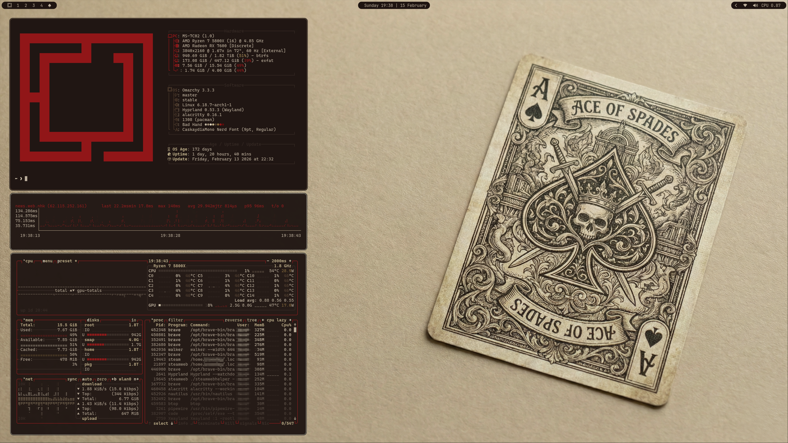

# Omarchy Bad Hand Theme

This is a custom theme for [Omarchy.org](https://omarchy.org) 

This theme draws inspiration from vintage playing cards and aged paper, evoking the atmosphere of an old gambling hall. The Bad Hand Theme uses a warm sepia palette with deep crimson accents, capturing the timeworn elegance of antique card decks while also keeping the grit of worn paper and well played cards.



## Installation

To install this theme, simply use the `omarchy-theme-install` command:

```bash
omarchy-theme-install https://github.com/bjornramberg/omarchy-bad-hand-theme
```
## Included Configurations
This theme includes configurations for:
- Alacritty (alacritty.toml) - Terminal emulator
- btop (btop.theme) - System resource monitor
- Chromium (chromium.theme) - Chromium-based browsers
- Color Palette (colors.toml) - Base color definitions for the theme
- Ghostty (ghostty.conf) - Terminal emulator
- Hyprland (hyprland.conf) - Wayland compositor
- Hyprlock (hyprlock.conf) - Screen locker for Hyprland
- Icons (icons.theme) - System icon theme
- Kitty (kitty.conf) - Terminal emulator
- Mako (mako.ini) - Notification daemon for Wayland
- Neovim (neovim.lua) - Text editor
- SwayOSD (swayosd.css) - On-screen display for volume/brightness
- Walker (walker.css) - Application launcher
- Warp (warp.yaml) - Terminal emulator
- Waybar (waybar.css) - Status bar for Wayland
- Wofi (wofi.css) - Application launcher for Wayland
- Zed (aether.zed.json, aether.override.css) - Code editor<br>

## Included backgrounds


_AI disclosure: AI was used in the creation of the background pictures for this theme._
